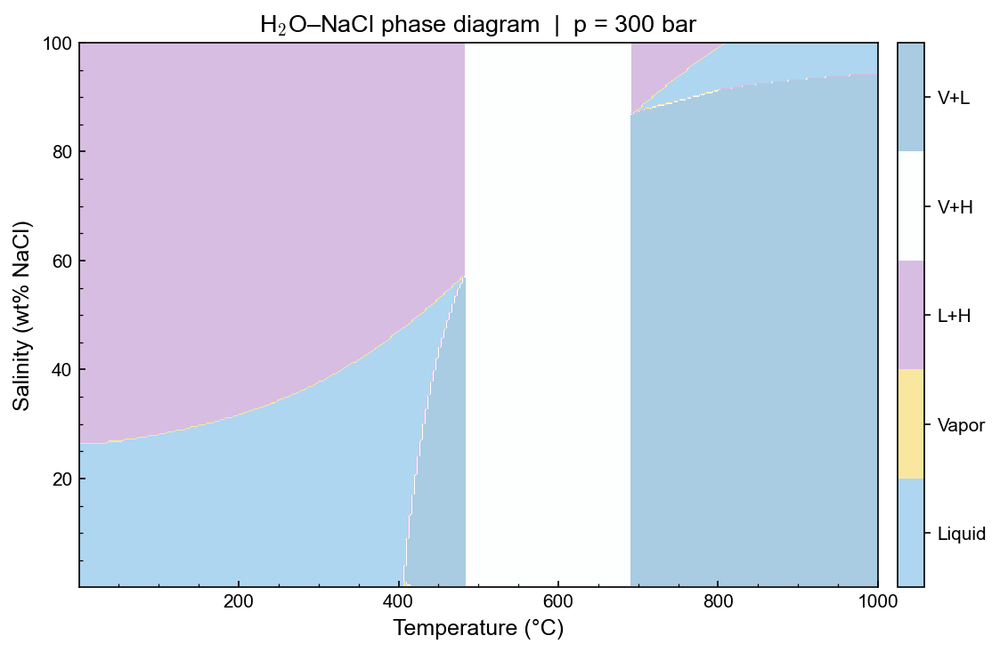

# Python API overview

The Python bindings expose the full H₂O–NaCl EOS as the `xThermal` package.



*Isobaric H₂O–NaCl phase diagram at 300 bar. Generated with the code below.*

??? example "Code to reproduce this figure"
    ```python
    import numpy as np
    import matplotlib.pyplot as plt
    import matplotlib as mpl
    import copy
    from xThermal import H2ONaCl

    sw = H2ONaCl.cH2ONaCl("IAPS84")
    P0 = 300e5   # Pa

    T = np.linspace(sw.Tmin(), sw.Tmax(), 300)
    X = np.linspace(1e-4, 1.0, 300)
    TT, XX = np.meshgrid(T, X)
    PP = np.full_like(TT, P0)

    state = sw.UpdateState_TPX(TT.ravel(), PP.ravel(), XX.ravel())
    Phase = np.array(state.phase).reshape(TT.shape)

    phase_unique = np.sort(np.unique(Phase))
    phase_names  = [sw.phase_name(int(p)) for p in phase_unique]
    Phase_plot   = np.zeros_like(Phase)
    for i, p in enumerate(phase_unique):
        Phase_plot[Phase == p] = i

    fig, ax = plt.subplots(figsize=(8, 5))
    cs = ax.contourf(TT - 273.15, XX * 100, Phase_plot,
                     levels=np.arange(-0.5, len(phase_unique)),
                     cmap='Dark2', vmin=-0.5, vmax=len(phase_unique) - 0.5)
    cb = fig.colorbar(cs, ax=ax, ticks=np.arange(len(phase_unique)))
    cb.ax.set_yticklabels(phase_names)
    ax.set_xlabel('Temperature (°C)')
    ax.set_ylabel('Salinity (wt% NaCl)')
    ax.set_title(r'H$_2$O–NaCl  |  p = 300 bar')
    plt.tight_layout()
    plt.show()
    ```
Three sub-modules are available:

| Module | Class | Description |
|---|---|---|
| `xThermal.H2O` | `cIAPS84`, `cIAPWS95` | Pure water EOS |
| `xThermal.NaCl` | `cNaCl` | Pure NaCl EOS |
| `xThermal.H2ONaCl` | `cH2ONaCl` | H₂O–NaCl mixture EOS |

## Import pattern

```python
from xThermal import H2ONaCl

sw = H2ONaCl.cH2ONaCl("IAPS84")   # water backend: "IAPS84" or "IAPWS95"
```

## Units

All functions use SI units:

| Quantity | Unit |
|---|---|
| Temperature | K |
| Pressure | Pa |
| Composition X | kg NaCl / kg total (mass fraction) |
| Density | kg/m³ |
| Enthalpy | J/kg |
| Heat capacity | J/kg/K |
| Viscosity | Pa·s |

## ThermodynamicProperties fields

The object returned by `UpdateState_TPX` and `UpdateState_HPX` has these fields:

| Field | Description |
|---|---|
| `Rho` | Bulk density (kg/m³) |
| `H` | Specific enthalpy (J/kg) |
| `Cp` | Isobaric heat capacity (J/kg/K) |
| `Mu` | Bulk dynamic viscosity (Pa·s) |
| `Mu_l` | Liquid phase viscosity (Pa·s) |
| `Mu_v` | Vapour phase viscosity (Pa·s) |
| `Rho_l` | Liquid phase density (kg/m³) |
| `Rho_v` | Vapour phase density (kg/m³) |
| `T` | Temperature (K) — useful when returned from HPX flash |
| `phase` | Phase index (integer) |
