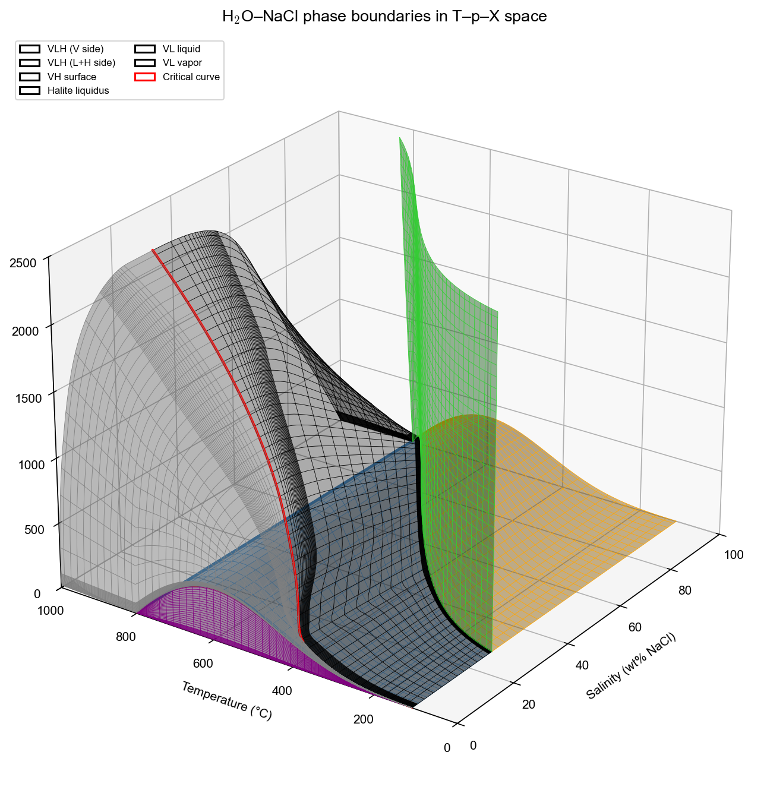
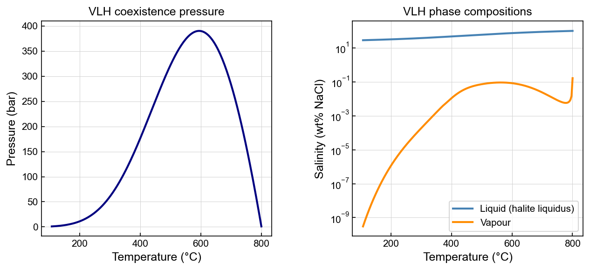

# Phase boundaries

xThermo provides functions to compute the key phase boundaries of the H₂O–NaCl system.

## 3-D overview

The full phase boundary structure in T–p–X space, showing the VLH surface, VH surface,
halite liquidus, VL two-phase surfaces, and the critical curve.



??? example "Code to reproduce this figure"
    ```python
    import warnings
    import numpy as np
    import matplotlib.pyplot as plt
    from matplotlib.patches import Patch
    from matplotlib.colors import to_hex
    from xThermal import H2ONaCl

    warnings.filterwarnings("ignore", category=RuntimeWarning)
    sw = H2ONaCl.cH2ONaCl("IAPS84")

    # ── VLH surface (V→L side and L→H side) ──────────────────────────────────
    nT = 80
    nT_high = nT // 3
    T_high  = H2ONaCl.T_MIN_VLH + (sw.Tmax_VLH() - H2ONaCl.T_MIN_VLH) * 0.95
    T_vlh   = np.append(np.linspace(H2ONaCl.T_MIN_VLH, T_high, nT - nT_high),
                        np.linspace(T_high, sw.Tmax_VLH(), nT_high))
    P_vlh   = np.array(sw.P_VLH(T_vlh))
    Xl_vlh, Xv_vlh = np.array(sw.X_VLH(T_vlh, P_vlh))

    n_log, n_lin = 20, 40
    nX = n_log + n_lin
    TT_vlh = np.tile(T_vlh, (nX, 1))
    PP_vlh = np.tile(P_vlh, (nX, 1))
    XX_V2L = np.zeros_like(TT_vlh)
    XX_L2H = np.zeros_like(TT_vlh)
    for j in range(len(T_vlh)):
        XX_V2L[:, j] = np.append(
            10 ** np.linspace(np.log10(max(Xv_vlh[j], 1e-10)), np.log10(0.01), n_log),
            np.linspace(0.01, Xl_vlh[j], n_lin))
        XX_L2H[:, j] = np.linspace(Xl_vlh[j], 1.0, nX)

    # ── VH surface ─────────────────────────────────────────────────────────────
    nP = 60
    T_vh = np.linspace(H2ONaCl.T_MIN_VLH, sw.Tmax_VLH(), nT)
    P_vlh2 = np.array(sw.P_VLH(T_vh))
    TT_vh = np.tile(T_vh, (nP, 1))
    PP_vh = np.zeros_like(TT_vh)
    np_low = nP // 3
    for i in range(len(T_vh)):
        p_low = sw.pmin() + (P_vlh2[i] - sw.pmin()) * 0.1
        PP_vh[:, i] = np.append(np.linspace(sw.pmin(), p_low, np_low),
                                np.linspace(p_low, P_vlh2[i], nP - np_low))
    XX_VH = np.array(sw.X_VH(TT_vh.ravel(), PP_vh.ravel())).reshape(TT_vh.shape)

    # ── Halite liquidus ────────────────────────────────────────────────────────
    TT_lh = np.tile(T_vh, (nP, 1))
    PP_lh = np.zeros_like(TT_lh)
    for i in range(len(T_vh)):
        PP_lh[:, i] = np.linspace(P_vlh2[i], 2500e5, nP)
    XL_LH = np.array(sw.X_HaliteLiquidus(TT_lh.ravel(), PP_lh.ravel())).reshape(TT_lh.shape)

    # ── VL surfaces ────────────────────────────────────────────────────────────
    pb_l = sw.PhaseBoundary_VL_DeformLinear(H2ONaCl.Liquid)
    pb_v = sw.PhaseBoundary_VL_DeformLinear(H2ONaCl.Vapor)

    # ── Critical curve ─────────────────────────────────────────────────────────
    T_crit = np.linspace(sw.get_pWater().T_critical(), sw.Tmax(), 80)
    p_crit, X_crit = np.array(sw.P_X_Critical(T_crit))

    # ── Plot ───────────────────────────────────────────────────────────────────
    fig = plt.figure(figsize=(12, 9))
    ax  = fig.add_subplot(111, projection='3d', facecolor='None')

    def surf(TT, PP, XX, color, label):
        ax.plot_surface(XX * 100, TT - 273.15, PP / 1e5,
                        color=color, alpha=0.45, linewidth=0)
        ax.plot_wireframe(XX * 100, TT - 273.15, PP / 1e5,
                          color=color, lw=0.4, label=label)

    surf(TT_vlh, PP_vlh, XX_V2L,  'steelblue', 'VLH (V side)')
    surf(TT_vlh, PP_vlh, XX_L2H,  'orange',    'VLH (L+H side)')
    surf(TT_vh,  PP_vh,  XX_VH,   'purple',    'VH surface')
    surf(TT_lh,  PP_lh,  XL_LH,   'limegreen', 'Halite liquidus')

    for pb, color, label in [(pb_l, 'black', 'VL liquid'), (pb_v, 'gray', 'VL vapor')]:
        T2 = np.array(pb.T); P2 = np.array(pb.p); X2 = np.array(pb.X)
        ax.plot_surface(X2 * 100, T2 - 273.15, P2 / 1e5, color=color, alpha=0.3, linewidth=0)
        ax.plot_wireframe(X2 * 100, T2 - 273.15, P2 / 1e5, color=color, lw=0.4, label=label)

    ax.plot(X_crit * 100, T_crit - 273.15, p_crit / 1e5, color='red', lw=2, label='Critical curve')
    ax.plot(Xv_vlh * 100, T_vlh - 273.15, P_vlh / 1e5, color='red',   lw=1)
    ax.plot(Xl_vlh * 100, T_vlh - 273.15, P_vlh / 1e5, color='green', lw=1)

    ax.set_xlabel('Salinity (wt% NaCl)', fontsize=10, labelpad=8)
    ax.set_ylabel('Temperature (°C)',    fontsize=10, labelpad=8)
    ax.set_zlabel('Pressure (bar)',      fontsize=10, labelpad=8)
    ax.set_xlim(0, 100); ax.set_ylim(0, 1000); ax.set_zlim(0, 2500)
    ax.view_init(elev=25, azim=-145)
    ax.set_title(r'H$_2$O–NaCl phase boundaries in T–p–X space', fontsize=13, pad=12)
    plt.tight_layout()
    plt.show()
    ```

## VLH coexistence surface

The three-phase vapour + liquid + halite (VLH) surface is parameterised by temperature.
The left panel shows the coexistence pressure; the right panel shows the saturated liquid
(halite liquidus) and vapour compositions along the surface.



```python
import numpy as np
import matplotlib.pyplot as plt
from xThermal import H2ONaCl

sw = H2ONaCl.cH2ONaCl("IAPS84")

T = np.linspace(H2ONaCl.T_MIN_VLH, H2ONaCl.T_MAX_VLH, 200)   # K
P_vlh = np.array(sw.P_VLH(T))                                  # Pa
XL_vlh, XV_vlh = np.array(sw.X_VLH(T, P_vlh))                 # kg/kg

fig, axes = plt.subplots(1, 2, figsize=(10, 4))

axes[0].plot(T - 273.15, P_vlh / 1e5)
axes[0].set_xlabel("Temperature (°C)")
axes[0].set_ylabel("Pressure (bar)")
axes[0].set_title("VLH coexistence pressure")

axes[1].plot(T - 273.15, XL_vlh * 100, label="Liquid (halite liquidus)")
axes[1].plot(T - 273.15, XV_vlh * 100, label="Vapour")
axes[1].set_yscale("log")
axes[1].set_xlabel("Temperature (°C)")
axes[1].set_ylabel("Salinity (wt% NaCl)")
axes[1].legend()
plt.tight_layout()
plt.show()
```

## Critical curve

```python
import numpy as np
import matplotlib.pyplot as plt
from xThermal import H2ONaCl

sw = H2ONaCl.cH2ONaCl("IAPS84")

T = np.linspace(sw.Tmin(), sw.Tmax(), 200)     # K
P_crit, X_crit = np.array(sw.P_X_Critical(T))  # Pa, kg/kg

fig, ax = plt.subplots()
ax.plot(T - 273.15, P_crit / 1e5)
ax.set_xlabel("Temperature (°C)")
ax.set_ylabel("Critical pressure (bar)")
ax.set_title("H\u2082O\u2013NaCl critical curve")
plt.show()
```

## Halite liquidus and VL compositions

Along the VLH surface, `X_VLH` returns the saturated liquid composition (halite liquidus) and the saturated vapour composition:

```python
XL_vlh, XV_vlh = np.array(sw.X_VLH(T, P_vlh))
# XL_vlh : liquid (halite liquidus) composition [kg/kg]
# XV_vlh : vapour composition [kg/kg]
```

For the V+L two-phase region below the VLH surface, use `XL_VL` and `XV_VL`:

```python
XL = np.array(sw.XL_VL(T, P))
XV = np.array(sw.XV_VL(T, P))
```
