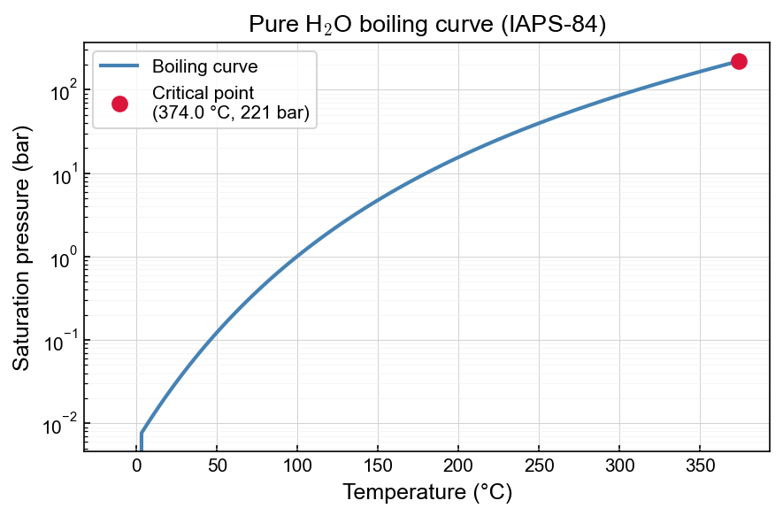

# Saturation (pure H₂O)

The `H2O` module provides the boiling curve and critical point of pure water.

## Boiling curve



```python
import numpy as np
import matplotlib.pyplot as plt
from xThermal import H2O

water = H2O.cIAPS84()

T = np.linspace(water.Tmin(), water.T_critical(), 100)   # K
p_boil = np.array([water.Boiling_p(Ti) for Ti in T])     # Pa

fig, ax = plt.subplots()
ax.plot(T - 273.15, p_boil / 1e5)
ax.plot(water.T_critical() - 273.15, water.p_critical() / 1e5,
        'ro', label=f"Critical point ({water.T_critical()-273.15:.1f} °C)")
ax.set_xlabel("Temperature (°C)")
ax.set_ylabel("Saturation pressure (bar)")
ax.set_yscale("log")
ax.legend()
plt.show()
```

## Saturated phase properties

`Boiling_p_props` returns liquid and vapour densities at saturation:

```python
from xThermal import H2O

water = H2O.cIAPS84()

T = 300 + 273.15   # K
prop = water.Boiling_p_props(T)

print(f"Saturation pressure: {prop.p/1e5:.2f} bar")
print(f"Liquid density:      {prop.Rho_l:.1f} kg/m³")
print(f"Vapour density:      {prop.Rho_v:.3f} kg/m³")
```

## Using IAPWS-95 instead of IAPS-84

```python
from xThermal import H2O

water = H2O.cIAPWS95()   # built-in IAPWS-95 implementation
```
